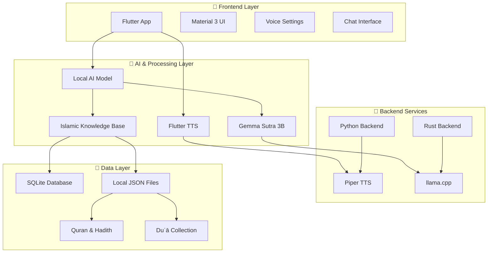

# 🕌 Akhī - Islamic AI Companion

> *"And whoever relies upon Allah - then He is sufficient for him. Indeed, Allah will accomplish His purpose."* - Quran 65:3

Akhī is an offline Islamic AI companion app designed to provide emotional support, Islamic guidance, and spiritual comfort to Muslim men. Built with Flutter and powered by local AI models, it offers a private, secure, and authentic Islamic experience.

## ✨ Features

- 💬 **AI Chat Interface** - Conversational Islamic guidance and emotional support
- 🎙️ **Text-to-Speech** - Hear responses in multiple languages with voice customization
- 😌 **Emotion Support** - Quick access to Islamic comfort for different emotional states
- 🤲 **Duʿā Suggestions** - Contextual prayers and supplications
- 🕋 **Islamic Personality** - Grounded in Quran, Hadith, and scholarly wisdom
- 🔒 **Completely Offline** - No internet required, full privacy protection
- 🎛️ **Voice Customization** - Adjust language, speed, pitch, and volume

## 🏗️ Technology Stack



### 📊 Architecture Overview

```
┌─────────────────────────────────────────────────────────────┐
│                    📱 Flutter Frontend                      │
│  ┌─────────────┐ ┌─────────────┐ ┌─────────────────────────┐ │
│  │   Chat UI   │ │ Emotion UI  │ │    Voice Settings       │ │
│  └─────────────┘ └─────────────┘ └─────────────────────────┘ │
└─────────────────────┬───────────────────────────────────────┘
                      │
┌─────────────────────┴───────────────────────────────────────┐
│                🧠 AI Processing Layer                       │
│  ┌─────────────┐ ┌─────────────┐ ┌─────────────────────────┐ │
│  │ Flutter TTS │ │ Local LLM   │ │   Islamic Knowledge     │ │
│  │   Engine    │ │ (Gemma 3B)  │ │        Base             │ │
│  └─────────────┘ └─────────────┘ └─────────────────────────┘ │
└─────────────────────┬───────────────────────────────────────┘
                      │
┌─────────────────────┴───────────────────────────────────────┐
│              🔧 Native Backend Services                     │
│  ┌─────────────┐ ┌─────────────┐ ┌─────────────────────────┐ │
│  │    Rust     │ │   Python    │ │      Piper TTS          │ │
│  │   Backend   │ │   Backend   │ │     (Optional)          │ │
│  └─────────────┘ └─────────────┘ └─────────────────────────┘ │
└─────────────────────┬───────────────────────────────────────┘
                      │
┌─────────────────────┴───────────────────────────────────────┐
│                💾 Local Data Storage                        │
│  ┌─────────────┐ ┌─────────────┐ ┌─────────────────────────┐ │
│  │   SQLite    │ │    JSON     │ │    Model Files          │ │
│  │  Database   │ │   Assets    │ │   (.gguf, .onnx)       │ │
│  └─────────────┘ └─────────────┘ └─────────────────────────┘ │
└─────────────────────────────────────────────────────────────┘
```

## 🛠️ Tech Stack Details

| Component | Technology | Purpose |
|-----------|------------|----------|
| **Frontend** | Flutter + Dart | Cross-platform mobile UI |
| **UI Framework** | Material 3 | Modern, accessible design |
| **AI Model** | Gemma Sutra 3B (GGUF) | Local Islamic-trained LLM |
| **TTS Engine** | Flutter TTS + Piper | Multi-language voice synthesis |
| **Backend** | Rust + Python | High-performance native processing |
| **Database** | SQLite | Local data persistence |
| **Model Runtime** | llama.cpp | Efficient GGUF model inference |
| **Knowledge Base** | JSON + SQLite | Quran, Hadith, Duʿā storage |

## 🚀 Roadmap

### ✅ Phase 1: Core Foundation (Completed)
- [x] Flutter app structure with Material 3 design
- [x] Basic chat interface with AI responses
- [x] Text-to-Speech integration with voice customization
- [x] Emotion-based quick responses
- [x] Local data storage setup
- [x] Git repository with proper branch structure

### 🚧 Phase 2: Islamic Knowledge Integration (In Progress)
- [ ] **Daily Islamic Reminders**
  - Automatic Quranic verses rotation
  - Hadith of the day
  - Scholar quotes integration
- [ ] **Enhanced Duʿā System**
  - Contextual prayer suggestions
  - Audio playback for common duʿā
  - "Hisnul Muslim" collection
- [ ] **Mood Tracking & Analytics**
  - "How is your heart today?" daily check-ins
  - Emotional pattern analysis
  - Islamic guidance based on mood history

### 🎯 Phase 3: AI Model Enhancement
- [ ] **Gemma Model Integration**
  - Local GGUF model deployment
  - llama.cpp backend integration
  - Rust FFI for model inference
- [ ] **LoRA Fine-tuning**
  - Islamic conversation training data
  - Emotional support scenarios
  - Scholar quote contextual responses
- [ ] **Knowledge Base Expansion**
  - Complete Quran integration (JSON)
  - Hadith database (SQLite)
  - Ibn al-Qayyim & al-Ghazali quotes

### 🌟 Phase 4: Advanced Features
- [ ] **Voice Input (ASR)**
  - Whisper.cpp integration
  - Arabic speech recognition
  - Voice-to-voice conversations
- [ ] **Personality Presets**
  - "Wise Akhī" - Scholarly responses
  - "Friendly Akhī" - Casual support
  - "Contemplative Akhī" - Deep reflection
- [ ] **Audio-Only Mode**
  - Night mode for bedtime comfort
  - Background audio guidance
  - Sleep-friendly interactions

### 🔮 Phase 5: Community & Sharing
- [ ] **Offline Sync**
  - Export/import personal data
  - Backup and restore functionality
- [ ] **Content Expansion**
  - Multiple language support
  - Regional Islamic traditions
  - Seasonal Islamic content
- [ ] **Accessibility**
  - Screen reader optimization
  - High contrast themes
  - Font size customization

## 🏃‍♂️ Quick Start

### Prerequisites
- Flutter SDK (3.0+)
- Dart SDK
- Android Studio / VS Code
- Git

### Installation

```bash
# Clone the repository
git clone https://github.com/YOUR_USERNAME/Akhi.git
cd Akhi

# Switch to feature branch for latest development
git checkout feature

# Install dependencies
flutter pub get

# Run the app
flutter run
```

### Building for Release

```bash
# Android APK
flutter build apk --release

# Android App Bundle
flutter build appbundle --release

# iOS (macOS only)
flutter build ios --release
```

## 📁 Project Structure

```
akhi/
├── lib/
│   └── main.dart              # Main Flutter application
├── android/                   # Android-specific configuration
├── ios/                       # iOS-specific configuration  
├── windows/                   # Windows desktop support
├── rust-backend/              # Rust native backend
│   ├── src/lib.rs            # Rust FFI interface
│   └── Cargo.toml            # Rust dependencies
├── python-backend/            # Python TTS backend
│   ├── main.py               # Python TTS server
│   └── requirements.txt      # Python dependencies
├── assets/                    # App assets and data
│   ├── islamic_data/         # Quran, Hadith, Duʿā
│   └── models/               # AI model files (gitignored)
└── docs/                      # Documentation
```

## 🤝 Contributing

We welcome contributions that align with Islamic values and improve the spiritual experience:

1. **Fork** the repository
2. **Create** a feature branch (`git checkout -b feature/amazing-feature`)
3. **Commit** your changes (`git commit -m 'Add amazing Islamic feature'`)
4. **Push** to the branch (`git push origin feature/amazing-feature`)
5. **Open** a Pull Request

### Guidelines
- All Islamic content must be from authentic sources
- Include proper attribution for Quranic verses and Hadith
- Maintain respectful and humble tone
- Test thoroughly on multiple devices
- Follow Flutter best practices

## 📜 Islamic Content Guidelines

> **Important**: This app provides emotional and spiritual support based on Islamic teachings. It is not a source of religious rulings (fatwa). For specific religious questions, always consult qualified Islamic scholars.

### Content Sources
- **Quran**: Authentic translations and transliterations
- **Hadith**: Sahih collections (Bukhari, Muslim, etc.)
- **Scholars**: Ibn al-Qayyim, al-Ghazali, Ibn Taymiyyah
- **Duʿā**: Hisnul Muslim and authentic supplications

## 📄 License

This project is licensed under the MIT License - see the [LICENSE](LICENSE) file for details.

## 🙏 Acknowledgments

- **Allah (SWT)** for guidance and blessing
- **Islamic scholars** whose wisdom guides this project
- **Flutter team** for the amazing framework
- **Gemma team** for the open-source AI model
- **Muslim developer community** for inspiration

---

*"And it is He who created the heavens and earth in truth. And the day He says, 'Be,' and it is, His word is the truth."* - Quran 6:73

**May this app bring comfort, guidance, and closeness to Allah for all who use it. Ameen.** 🤲
